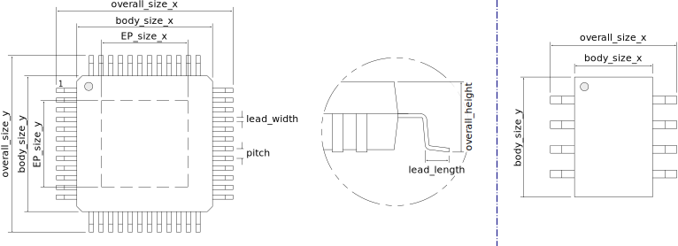

# IPC gullwing generator

This generator uses IPC-7351B equations and by default fillet definitions to derive a footprint for gullwing stile packages.
Examples of supported packages include: QFN, SOIC, SO

## Running the script

The script requires python 3.4 or newer. Run it with:
`python3 ipc_gullwing_generator.py size_definitions/eqfp.yaml` (replace eqfp.yaml with the size definition file that contains your part.)

## Size definition format

Every file contains a header with parameters applied to all parts. These define the common footprint name prefix and the output library.

``` yaml
FileHeader:
  library_Suffix: 'QFP' #resulting library name Package_QFP
  device_type: 'EQFP' #footprint names will be of style ...EQFP-pincount_...
```

---

Every further entry in the script is assumed to be a package size definition. The top level parameter will give the internal parameter set name. This one must be unique in this file and should be representative of the footprint as it will be used in error messages. (It also makes later maintenance easier if it is easy to determine which footprint was genererated by which parameter set.)

``` yaml
internal_package_name:
  # parameter list (See below)
```

### Documentation and naming parameters
- Size source to be added to footprint documentation field (`size_source`) {url}
- footprint name control
  - Manufacturer if specific to one manufacturer (`manufacturer`) {string}
  - Part number if specific to one part (`part_number`) {string}
  - Custom naming (`custom_name_format`) {format string}

### Package dimensions

- Body size (`body_size_x`, `body_size_y`, `overall_height`) {dimension}
- Lead dimensions:
  - Over all size representing lead tip to lead tip dimension (`overall_size_x`, `overall_size_y`) {dimension}
  - Lead with (`lead_width`) {dimension}
  - Lead length representing tip till bend (`lead_len`)
- lead pitch, currently equal for all sides (`pitch`) {float}
- pin count, 0 means no pins in that direction (`num_pins_x`, `num_pins_y`) {int}


### Exposed pad handling:

- Size of package exposed pad or slug (`EP_size_x`, `EP_size_y`) {dimension}
- Optional the size of the footprint pad (`EP_size_x_overwrite`, `EP_size_y_overwrite`) {float}
   - Pad size is equal to nominal package pad size if not given.
- Optional the size of the mask cutout (`EP_mask_x`, `EP_mask_y`) {float}
   - Use to create solder mask defined pads (in combination with `EP_size_x_overwrite`)
- Paste is typically split into a regular grid with (`EP_num_paste_pads`) {[int (x), int (y)]}
  - The paste coverage multiplicator determines how much of the exposed copper area is covered by paste. (`EP_paste_coverage`) {float (0..1), default=0.65}

### Thermal vias
A package with exposed pad can generate a version with thermal vias. This will be generated in addition to the normal version.
``` yaml
  thermal_vias:
    # thermal via version parameters
```
- Number of vias generated in the regular grid (`count`) {[int (x), int (y)]}
- Final hole size (`drill`) {float}
- Optional grid (`grid`) {[float (x), float (y)]}
  - Auto generated if not given (outermost pad will touch pad edge.)
- Optional paste coverage overwrite (`EP_paste_coverage`) {float (0..1)}
  - Increase compared to non thermal via version to combat solder loss through wicking.
- Should paste avoid vias? (`paste_avoid_via`) {bool}
  - Can lead to math exceptions (reduce paste coverage)
  - Clearance between via hole and paste controlled with (`paste_via_clearance`) {float}
- Number paste pads
  - given as count value (`EP_num_paste_pads`) {[int (x), int (y)]}
  - More specific as between vias and outside ring (`paste_between_vias`, `paste_rings_outside`)


## Dimension parameter format

### String based

The parameter can be given as a string of one of the following formats (whitespace characters are ignored).

```yaml
parameter_name: 1.2 # nominal only (reference dimension marked as such in datasheet)
parameter_name: 1.1 .. 1.2 .. 1.3 # min .. nominal .. max
parameter_name: 1.1 .. 1.3 # min .. max
parameter_name: 1.2 +/-0.1 # nominal plus symmetrical tolerance
parameter_name: 1.2 +0.1 -0.05 # nominal plus asymmetrical tolerance
```

### Dict based

```yaml
parameter_name: # nominal only
  nominal: 1.2
  tolerance: 0 # optional to make it clear that this is the case
parameter_name: # minimum maximum and nominal
  minimum: 1.1
  nominal: 1.2 # is optional but should be included if given in the datasheet
  maximum: 1.3
parameter_name: # nominal with symmetrical tolerance
  nominal: 1.2
  tolerance: 0.1
parameter_name: # nominal with asymmetrical tolerance
  nominal: 1.2
  tolerance: [-0.05, 0.1] # order does not matter, the sign is important.
```

### Deprecated format

Support for this format will be dropped in the future.

```yaml
parameter_name_min: 1.1
parameter_name: 1.2
parameter_name_max: 1.3
```
